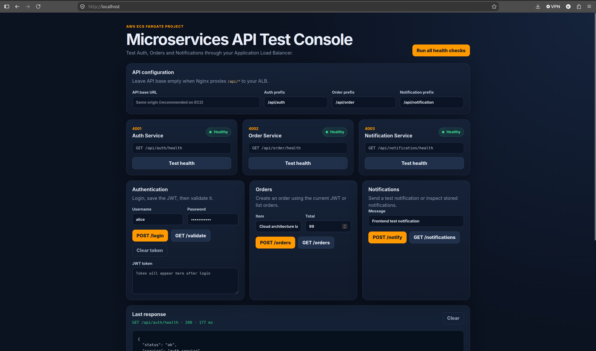

# Containerized Microservices on AWS ECS Fargate

A cloud-native microservices project built to practice containerization, service discovery, private networking, CI/CD, and AWS managed services.

The application is split into three Node.js microservices:

- **Auth Service** — authentication and JWT handling
- **Order Service** — order management
- **Notification Service** — notification handling

The services run on **Amazon ECS Fargate** inside private subnets and are exposed through an **Application Load Balancer**.

## Architecture


### Main flow

```text
Client
  |
  v
Application Load Balancer
  |
  +--> /api/auth/* ---------> Auth Service :4001
  +--> /api/order/* --------> Order Service :4002
  +--> /api/notification/* -> Notification Service :4003
```

Internal service-to-service communication uses **AWS Cloud Map**:

```text
auth-service.microservices.local:4001
notification-service.microservices.local:4003
```

## AWS Services Used

| Service | Purpose |
|---|---|
| Amazon ECS Fargate | Runs the containerized microservices |
| Amazon ECR | Stores Docker images |
| Application Load Balancer | Routes external API traffic |
| AWS Cloud Map | Internal DNS-based service discovery |
| AWS Secrets Manager | Stores the Auth JWT secret |
| Amazon ElastiCache for Redis | Shared cache/session store with TLS |
| Amazon VPC | Isolated network for the application |
| NAT Gateway | Outbound internet access for private tasks |
| Internet Gateway | Internet connectivity for public resources |
| AWS CodePipeline | CI/CD pipeline orchestration |
| AWS CodeBuild | Builds and pushes Docker images |
| Amazon S3 | Stores pipeline/build artifacts |
| Amazon CloudWatch | Logs and metrics |
| AWS X-Ray | Distributed tracing / observability |

> AWS CodeDeploy blue/green deployment is part of the planned architecture but was not configured in the current environment.

## Repository Structure

```text
.
├── auth-service/
│   ├── Dockerfile
│   └── ...
├── order-service/
│   ├── Dockerfile
│   └── ...
├── notification-service/
│   ├── Dockerfile
│   └── ...
├── docker-compose.yml
└── buildspec.yml
```

## Run the Microservices Locally

Make sure Docker and Docker Compose are installed.

```bash
git clone https://github.com/salmanebaba/Containerized-Microservices-with-ECS-Fargate-and-Service-Discovery.git
cd Containerized-Microservices-with-ECS-Fargate-and-Service-Discovery
docker compose up --build
```

Typical local ports:

```text
Auth Service          http://localhost:4001
Order Service         http://localhost:4002
Notification Service  http://localhost:4003
```

Stop the environment with:

```bash
docker compose down
```

## Local API Tests

Health checks:

```bash
curl http://localhost:4001/api/auth/health
curl http://localhost:4002/api/order/health
curl http://localhost:4003/api/notification/health
```

Example Auth login request:

```bash
curl -X POST http://localhost:4001/api/auth/login \
  -H "Content-Type: application/json" \
  -d '{
    "username": "alice",
    "password": "password123"
  }'
```

If the login returns a JWT token, it can be used for protected endpoints:

```bash
curl http://localhost:4002/api/order/orders \
  -H "Authorization: Bearer YOUR_TOKEN"
```

## Test the Deployed AWS APIs

The current Application Load Balancer endpoint is:

```text
http://microservices-alb-176688164.eu-west-3.elb.amazonaws.com
```

Health checks:

```bash
curl http://microservices-alb-176688164.eu-west-3.elb.amazonaws.com/api/auth/health

curl http://microservices-alb-176688164.eu-west-3.elb.amazonaws.com/api/order/health

curl http://microservices-alb-176688164.eu-west-3.elb.amazonaws.com/api/notification/health
```

Example login:

```bash
curl -X POST \
  http://microservices-alb-176688164.eu-west-3.elb.amazonaws.com/api/auth/login \
  -H "Content-Type: application/json" \
  -d '{
    "username": "alice",
    "password": "password123"
  }'
```

## Simple Frontend API Tester

A lightweight static frontend can be used to test:

- Auth, Order, and Notification health endpoints
- Login and JWT responses
- Order APIs
- Notification APIs
- Raw HTTP responses

The frontend can be served locally with Nginx.



### Run the frontend locally

Install Nginx:

```bash
sudo apt update
sudo apt install -y nginx
```

Copy the frontend files:

```bash
sudo rm -rf /var/www/html/*
sudo cp index.html /var/www/html/
sudo cp styles.css /var/www/html/
sudo cp app.js /var/www/html/
```

A simple Nginx configuration can proxy `/api/` requests to the AWS ALB:

```nginx
server {
    listen 80 default_server;
    listen [::]:80 default_server;

    server_name _;

    root /var/www/html;
    index index.html;

    location = / {
        try_files /index.html =404;
    }

    location / {
        try_files $uri =404;
    }

    location /api/ {
        proxy_pass http://microservices-alb-176688164.eu-west-3.elb.amazonaws.com;
        proxy_http_version 1.1;

        proxy_set_header Host microservices-alb-176688164.eu-west-3.elb.amazonaws.com;
        proxy_set_header X-Real-IP $remote_addr;
        proxy_set_header X-Forwarded-For $proxy_add_x_forwarded_for;
        proxy_set_header X-Forwarded-Proto $scheme;
    }
}
```

Validate and restart Nginx:

```bash
sudo nginx -t
sudo systemctl restart nginx
```

Open:

```text
http://localhost
```

Quick proxy test:

```bash
curl -i http://localhost/api/auth/health
```

## CI/CD

Current pipeline:

```text
GitHub
  |
  v
CodePipeline
  |
  v
CodeBuild
  |
  +--> Amazon ECR
  |      Docker images tagged with CODEBUILD_BUILD_NUMBER
  |
  +--> Amazon S3
         BuildArtifact / imagedefinitions.json
```

CodeBuild creates versioned images instead of relying only on `latest`, for example:

```text
containerized-microservices-auth:12
containerized-microservices-orders:12
containerized-microservices-notifications:12
```

This makes image versions easier to track and roll back.

## Networking

```text
VPC: 10.0.0.0/16

Public Subnet A:  10.0.1.0/24
Public Subnet B:  10.0.2.0/24

Private Subnet A: 10.0.11.0/24
Private Subnet B: 10.0.12.0/24
```

The ECS services run in the private subnets. The ALB is internet-facing across the public subnets, and private workloads use the NAT Gateway for outbound access.
